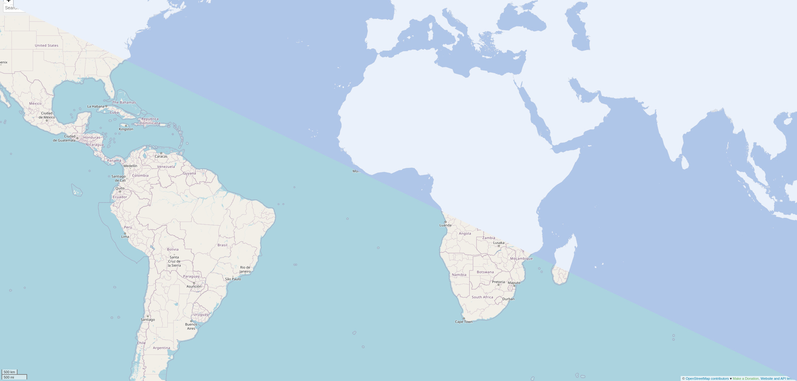

====================
mod_tile and renderd
====================

This software contains two main pieces:

1) ``mod_tile``: An Apache 2 module to deliver map tiles.
2) ``renderd``: A daemon that renders map tiles using mapnik.

Together they efficiently render and serve raster map tiles for example
to use within a slippy map. The two consist of the classic raster tile
stack from `OpenStreetMap.org <https://openstreetmap.org>`__.

As an alternative to ``renderd`` its drop-in replacement
`Tirex <https://github.com/openstreetmap/tirex>`__ can be used in
combination with ``mod_tile``.

Dependencies
------------

* `Supported Operating Systems`
    * `FreeBSD`
    * `GNU/Linux`
    * `macOS`
* `Supported Build Systems`
    * `CMake <https://cmake.org/>`__
    * `GNU Autotools <https://www.gnu.org/software/software.html>`__
* `Runtime/Build Dependencies`
    * `Apache 2 HTTP webserver <https://httpd.apache.org/>`__
    * `Cairo 2D graphics library (optional) <https://cairographics.org/>`__
    * `Curl library (optional) <https://curl.haxx.se/>`__
    * `GLib library <https://gitlab.gnome.org/GNOME/glib>`__
    * `Iniparser library <https://github.com/ndevilla/iniparser>`__
    * `Mapnik library <https://mapnik.org/>`__
    * `Memcached library (optional) <https://libmemcached.org/>`__
    * `RADOS library (optional) <https://docs.ceph.com/en/latest/rados/api/librados/>`__

Installation
------------

Starting from the following operation systems and their versions:

* Debian 11 (Bullseye)
* Ubuntu 21.04 (Hirsute Hippo)

the software and all dependencies can be installed simply with:

::

    $ apt install libapache2-mod-tile renderd

These packages for **Debian** and **Ubuntu** are being maintained by
the `Debian GIS Team <https://wiki.debian.org/DebianGis>`__ in the respective
`repository <https://salsa.debian.org/debian-gis-team/libapache2-mod-tile>`__.

Compilation
-----------

You may want to compile this software yourself. Either for developing on it or
when using it on an operating system this is not being packaged for.

We prepared instructions for you on how to build the software on the following
distributions:

* `Arch Linux </docs/build/building_on_arch_linux.md>`__
* `CentOS Stream </docs/build/building_on_centos_stream.md>`__
* `Debian </docs/build/building_on_debian.md>`__
* `Fedora </docs/build/building_on_fedora.md>`__
* `FreeBSD </docs/build/building_on_freebsd.md>`__
* `macOS </docs/build/building_on_macos.md>`__
* `openSUSE </docs/build/building_on_opensuse.md>`__
* `Ubuntu </docs/build/building_on_ubuntu.md>`__

Configuration
-------------

After you either installed the software packages or compiled the software
yourself, you can continue with the configuration. For your convenience
example configuration files are distributed with the software packages and
located in the ``etc`` directory of this repository.

A very basic example-map and data can be found in the ``utils/example-map``
directory.

For a simple test copy it over to ``/usr/share/renderd/example-map``:

::

    $ sudo mkdir -p /usr/share/renderd
    $ sudo cp -av utils/example-map /usr/share/renderd/

Copy the apache configuration file to its place, too:

::

    $ sudo cp -av etc/apache2/renderd-example-map.conf /etc/apache2/sites-available/renderd-example-map.conf

Add map configurations for example-map to ``/etc/renderd.conf``:

::

    $ printf '
    [example-map]
    URI=/tiles/renderd-example
    XML=/usr/share/renderd/example-map/mapnik.xml

    [example-map-jpg]
    TYPE=jpg image/jpeg jpeg
    URI=/tiles/renderd-example-jpg
    XML=/usr/share/renderd/example-map/mapnik.xml

    [example-map-png256]
    TYPE=png image/png png256
    URI=/tiles/renderd-example-png256
    XML=/usr/share/renderd/example-map/mapnik.xml

    [example-map-png32]
    TYPE=png image/png png32
    URI=/tiles/renderd-example-png32
    XML=/usr/share/renderd/example-map/mapnik.xml

    [example-map-webp]
    TYPE=webp image/webp webp
    URI=/tiles/renderd-example-webp
    XML=/usr/share/renderd/example-map/mapnik.xml
    ' | sudo tee -a /etc/renderd.conf

Ensure the ``/run/renderd`` directory exists:

::

    $ sudo mkdir -p /run/renderd

Start the rendering daemon:

::

    $ sudo renderd

Enable the apache module and site:

::

    $ sudo a2enmod tile
    $ sudo a2ensite renderd-example-map

Restart apache:

::

    $ sudo apache2ctl restart

Now visit the renderd example map in your browser, e.g.:

::

    http://localhost/renderd-example-map

Or try loading a single tile, e.g:

::

    http://localhost:8081/tiles/renderd-example/0/0/0.png

*Note: the above commands and paths may differ based on your OS/distribution.*

You may edit ``/etc/renderd.conf`` to indicate the location of different
mapnik style sheets (up to ten) and the endpoints you wish to use to access
it.

It is recommended to checkout `switch2osm
<https://switch2osm.org/serving-tiles/>`__ for nice tutorials
on how to set up a full tile server like on  `OpenStreetMap.org
<https://www.openstreetmap.org/>`__, using this software together with a
`PostgreSQL <https://www.postgresql.org/>`__ database and data from
OpenStreetMap.

Details about ``renderd``: Tile rendering
-----------------------------------------

The rendering is implemented in a multithreaded process
called ``renderd`` which opens either a unix or tcp socket
and listens for requests to render tiles. It uses Mapnik
to render tiles using the rendering rules defined in
the configuration file ``/etc/renderd.conf``. Its configuration
also allows to specify the number of rendering
threads.

The render daemon implements a queuing mechanism with multiple
priority levels to provide an as up-to-date viewing experience
given the available rendering resources. The highest priority
is for on the fly rendering of tiles not yet in the tile cache,
two priority levels for re-rendering out of date tiles on the fly
and two background batch rendering queues. The on the fly rendering
queues are limited to a short 32 metatile size to minimize latency.
The size of the main background queue is determined
at compile time, see: ``render_config.h``

Details about ``mod_tile``: Tile serving
----------------------------------------

An Apache module called ``mod_tile`` enhances the regular
Apache file serving mechanisms to provide:

1) When tiles have expired it requests the rendering daemon to render (or re-render) the tile.
2) Remapping of the file path to the hashed layout.
3) Prioritizes rendering requests depending on the available resources on the server and how out of date they are.
4) Use tile storage other than a plain posix file system. e.g it can store tiles in a ceph object store, or proxy them from another tile server.
5) Tile expiry. It estimates when the tile is next likely to be rendered and adds the appropriate HTTP cache expiry headers. This is a configurable heuristic.

To avoid problems with directories becoming too large and to avoid
too many tiny files. They store the rendered tiles in "meta tiles" in a
special hashed directory structure. These combine 8x8 actual tiles into a
single metatile file. This is a more efficient use of disk space and inodes.

The metatiles are then stored in the following directory structure:
``/[base_dir]/[TileSetName]/[Z]/[xxxxyyyy]/[xxxxyyyy]/[xxxxyyyy]/[xxxxyyyy]/[xxxxyyyy].meta``

Where ``base_dir`` is a configurable base path for all tiles. ``TileSetName``
is the name of the style sheet rendered. ``Z`` is the zoom level.
``[xxxxyyyy]`` is an 8 bit number, with the first 4 bits taken from the x
coordinate and the second 4 bits taken from the y coordinate. This
attempts to cluster 16x16 square of tiles together into a single sub
directory for more efficient access patterns.

Apache serves the files as if they were present under
``/[TileSetName]/Z/X/Y.png`` with the path being converted automatically.

Notes about performance
-----------------------

``mod_tile`` is designed for high performance tile serving. If the
underlying disk system allows it, it can easily provide > 10k tiles/s
on a single serve.

Rendering performance is mostly dependent on mapnik and postgis performance,
however ``renderd`` tries to make sure it uses underlying hardware as
efficiently as possible and scales well on multi core systems. ``renderd``
also provides built-in features to scale to multi server rendering set-ups.

Copyright and copyleft
----------------------

Copyright (c) 2007 - 2023 by mod_tile contributors (see `AUTHORS <./AUTHORS>`__)

This program is free software: you can redistribute it and/or modify it
under the terms of the GNU General Public License as published by the
Free Software Foundation, either version 2 of the License, or (at your
option) any later version.

This program is distributed in the hope that it will be useful, but
WITHOUT ANY WARRANTY; without even the implied warranty of
MERCHANTABILITY or FITNESS FOR A PARTICULAR PURPOSE. See the GNU General
Public License for more details.

You should have received a copy of the GNU General Public License
along with this program. If not, see http://www.gnu.org/licenses/.

See the `COPYING <./COPYING>`__ for the full license text.
